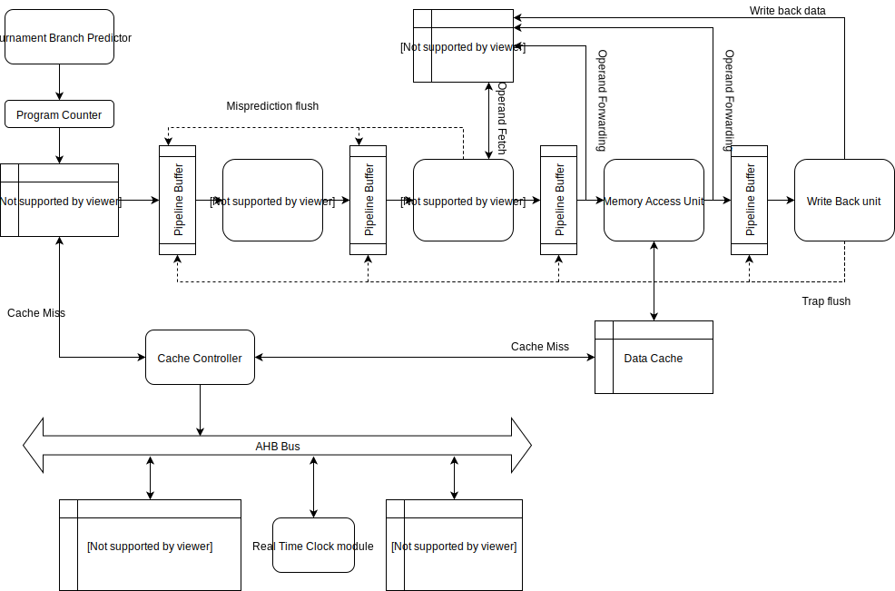

## Block Diagram

The C-32 architecture consists of the following 6 pipeline stages:
* Branch prediction Unit
* Instruction Fetch Unit
* Instruction Decode Unit
* Operand Fetch and Execute Unit (Branches are handled here itself)
* Memory Access Unit
* Write Back Unit

The branch predictor provides the next  program counter (PC) that needs to be fetched. The Instruction fetch stage
sends the PC to the Instruction Cache (I-Cache). If there is a hit in the I-Cache then the respective instruction
is returned to the instruction fetch stage. In case of a miss, the address of the corresponding line in the cache
is sent to the cache-controller which in turn fetches the line from the application memory through the AHB Bus.

The fetched instruction is sent to the decode stage where operand addresses, type of instruction, etc is deduced
and sent over to the next stage. In this stage the operands are fetched. During operand fetch the operand forwarding
lines from the following stages are polled (in a priority order) to check if any of them can provide the necessary 
operands for the current instruction. If the current instruction is independent of the instructions in the following
stages then it simply fetches the operands from the Register File. Once the operands are available the same stage executes
the instruction. For loads/stores this stage simply calculates the effective address and sends it to the next stage - Memory
Access Unit. In case of branch instructions the prediction of the Branch predictor is validated. In case of the a misprediction
the preeding two pipeline buffers are flushed (i.e. data is removed) and the PC is reset to the required address.

If the instruction is not a Load/Store instruction is bypasses any operation in the memory access unit and is buffered
into the write-back unit. However, in case of a Load/Store the address and data are passed to the Data cache to perform
the respective write/read from memory. Once the data cache has responded with valid data/acknowledgement the instruction
then passes over to the write-back stage. 

In the write-back stage the following checks happen in the specified order

* Are there any pending interrupts?
* Has the current instruction generated any exceptions?
* If it is a system instruction does make a valid access to the CSR registers?

If any of the above condition evaluates to true then a trap is taken which causes the pipeline buffers to be flushed
resetting the PC. In case no trap is taken then the instruction commits and updates the respective regsiter in the 
RegisterFile and terminates.

More detailed working of each unit and code-wise split up is provided in the next sections.

